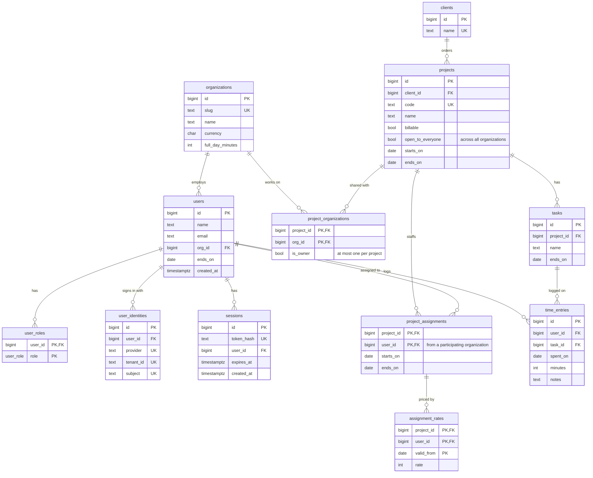

```mermaid
erDiagram
organizations ||--o{ users : employs
organizations ||--o{ project_organizations : "works on"
users ||--o{ user_roles : has
users ||--o{ user_identities : "signs in with"
users ||--o{ sessions : has
clients ||--o{ projects : "orders"
projects ||--o{ tasks : has
projects ||--o{ project_organizations : "shared with"
projects ||--o{ project_assignments : staffs
users ||--o{ project_assignments : "assigned to"
project_assignments ||--o{ assignment_rates : "priced by"
users ||--o{ time_entries : logs
tasks ||--o{ time_entries : "logged on"

    organizations {
        bigint id PK
        text slug UK
        text name
        char currency
        int full_day_minutes
    }
    users {
        bigint id PK
        text name
        text email
        bigint org_id FK
        date ends_on
        timestamptz created_at
    }
    user_roles {
        bigint user_id PK, FK
        user_role role PK
    }
    user_identities {
        bigint id PK
        bigint user_id FK
        text provider UK
        text tenant_id UK
        text subject UK
    }
    sessions {
        bigint id PK
        text token_hash UK
        bigint user_id FK
        timestamptz expires_at
        timestamptz created_at
    }
    clients {
        bigint id PK
        text name UK
    }
    projects {
        bigint id PK
        bigint client_id FK
        text code UK
        text name
        bool billable
        bool open_to_everyone "across all organizations"
        date starts_on
        date ends_on
    }
    project_organizations {
        bigint project_id PK, FK
        bigint org_id PK, FK
        bool is_owner "at most one per project"
    }
    tasks {
        bigint id PK
        bigint project_id FK
        text name
        date ends_on
    }
    project_assignments {
        bigint project_id PK, FK
        bigint user_id PK, FK "from a participating organization"
        date starts_on
        date ends_on
    }
    assignment_rates {
        bigint project_id PK, FK
        bigint user_id PK, FK
        date valid_from PK
        int rate
    }
    time_entries {
        bigint id PK
        bigint user_id FK
        bigint task_id FK
        date spent_on
        int minutes
        text notes
    }
```
